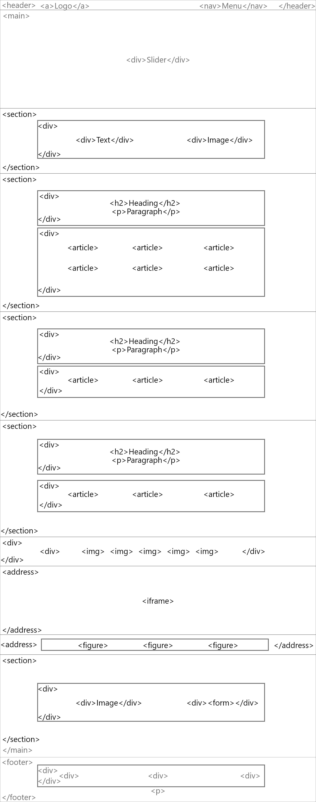
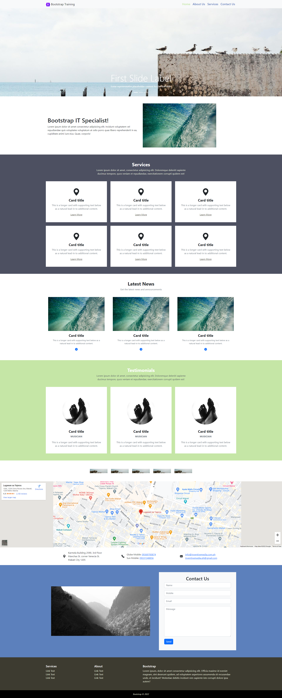
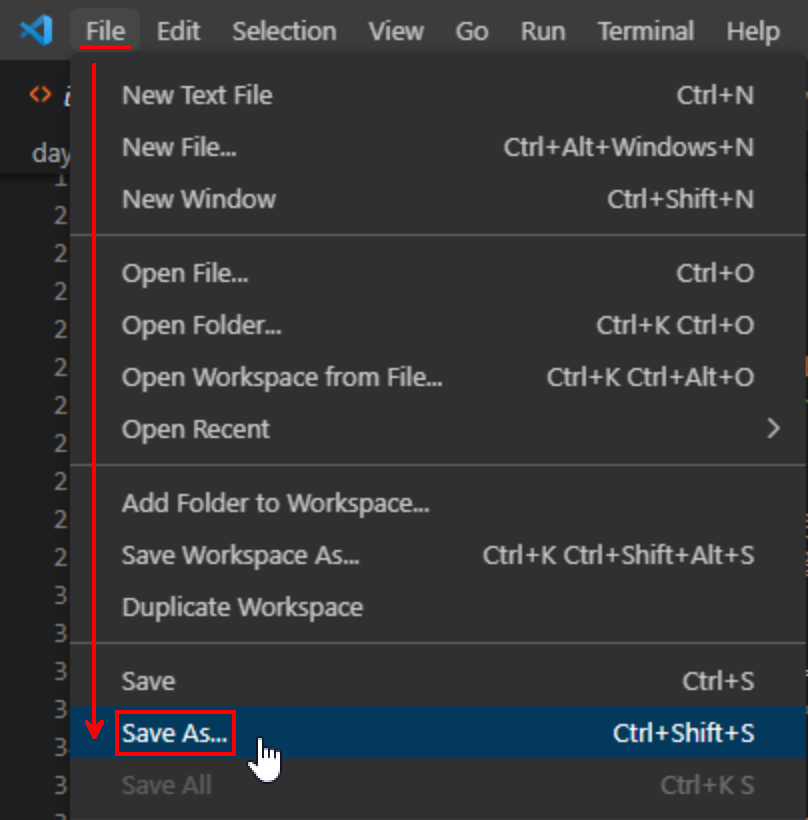
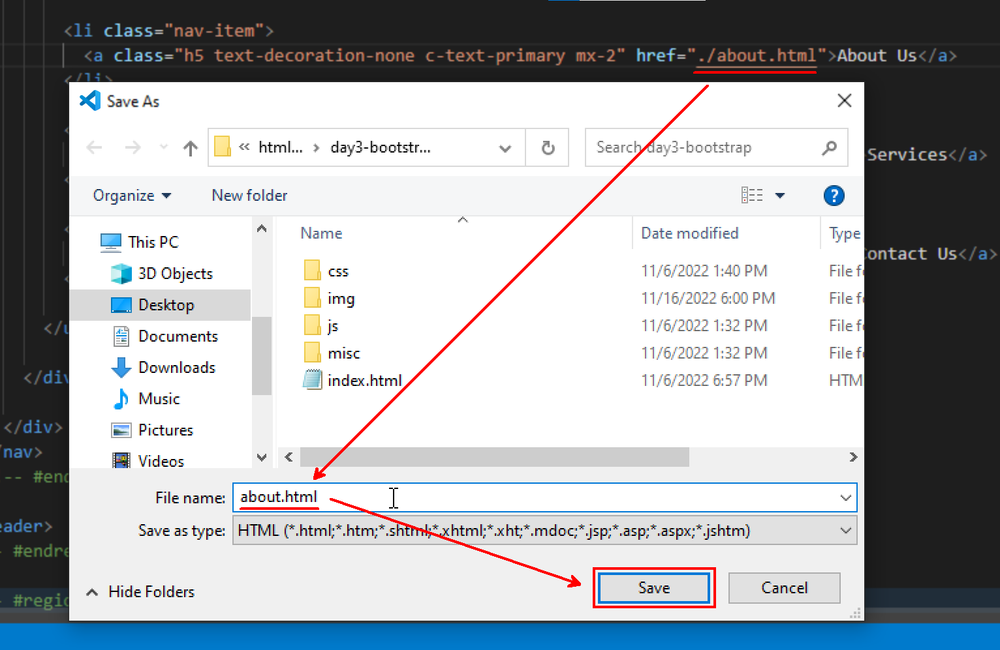

# Day 3 Cheatsheet

## Table of Contents
- [Links](#links)
  - [Bootstrap Links](#bootstrap-links)
- [Wire Frame](#wire-frame)
- [Design Mockup](#design-mockup)
- [Regions](#regions)
- [Bootstrap Components](#bootstrap-components)
  - [Navbar](#navbar)
  - [Carousel](#carousel)
  - [Cards](#cards)
- [Page Creation](#page-creation)
- [Final Output](#final-output)


## Links

### Useful links
- [Google Fonts](https://fonts.google.com/)
- [Bootstrap](https://getbootstrap.com/)
- [Bootstrap Icons](https://icons.getbootstrap.com/)
- [Bootstrap Cheatsheet](https://bootstrap-cheatsheet.themeselection.com/)
- [Coolors.co](https://coolors.co/)
- [Utopia Fluid Type Scale Calculator](https://utopia.fyi/type/calculator/)
- [//unsplash.it/width/height](https://picsum.photos/)

[Back to Top](#day-3-cheatsheet)

### Bootstrap Links

#### CDN
Paste this code inside the `<head>` tag

```html
<!-- CSS only -->
<link href="https://cdn.jsdelivr.net/npm/bootstrap@5.3.0-alpha1/dist/css/bootstrap.min.css" rel="stylesheet" integrity="sha384-GLhlTQ8iRABdZLl6O3oVMWSktQOp6b7In1Zl3/Jr59b6EGGoI1aFkw7cmDA6j6gD" crossorigin="anonymous">
```

Paste this code right before the closing `</body>` tag
```html
<!-- JavaScript Bundle with Popper -->
<script src="https://cdn.jsdelivr.net/npm/bootstrap@5.3.0-alpha1/dist/js/bootstrap.bundle.min.js" integrity="sha384-w76AqPfDkMBDXo30jS1Sgez6pr3x5MlQ1ZAGC+nuZB+EYdgRZgiwxhTBTkF7CXvN" crossorigin="anonymous"></script>
```

[Back to Top](#day-3-cheatsheet)

## Wire Frame



[Back to Top](#day-3-cheatsheet)

## Design Mockup



[Back to Top](#day-3-cheatsheet)


## Regions

```html
  <!-- #region Header -->
  <header>

    <!-- #region Primary Navigation -->
    
    <!-- #endregion Primary Navigation -->

  </header>
  <!-- #endregion Header -->

  <!-- #region Main -->
  <main>

    <!-- #region Slider -->
    <div>

    </div>
    <!-- #endregion Slider -->

    <!-- #region Hero -->
    <section>

    </section>
    <!-- #endregion Hero -->

    <!-- #region Services -->
    <section>

    </section>
    <!-- #endregion Services -->

    <!-- #region News -->
    <section>

    </section>
    <!-- #endregion News -->

    <!-- #region Testimonials -->
    <section>

    </section>
    <!-- #endregion Testimonials -->

    <!-- #region Clients -->
    <div>

    </div>
    <!-- #endregion Clients -->

    <!-- #region Map -->
    <address>

    </address>
    <!-- #endregion Map -->

    <!-- #region Address -->
    <address>

    </address>
    <!-- #endregion Address -->

    <!-- #region Form -->
    <section>
      
    </section>
    <!-- #endregion Form -->

  </main>
  <!-- #endregion Main -->

  <!-- #region Footer -->
  <footer>

  </footer>
  <!-- #endregion Footer -->
```

[Back to Top](#day-3-cheatsheet)

## Bootstrap Components

### Navbar

```html
<nav class="navbar navbar-expand-lg bg-light">
  <div class="container-fluid">
    <a class="navbar-brand" href="#">Navbar</a>
    <button class="navbar-toggler" type="button" data-bs-toggle="collapse" data-bs-target="#navbarSupportedContent" aria-controls="navbarSupportedContent" aria-expanded="false" aria-label="Toggle navigation">
      <span class="navbar-toggler-icon"></span>
    </button>
    <div class="collapse navbar-collapse" id="navbarSupportedContent">
      <ul class="navbar-nav me-auto mb-2 mb-lg-0">
        <li class="nav-item">
          <a class="nav-link active" aria-current="page" href="#">Home</a>
        </li>
        <li class="nav-item">
          <a class="nav-link" href="#">Link</a>
        </li>
        <li class="nav-item dropdown">
          <a class="nav-link dropdown-toggle" href="#" role="button" data-bs-toggle="dropdown" aria-expanded="false">
            Dropdown
          </a>
          <ul class="dropdown-menu">
            <li><a class="dropdown-item" href="#">Action</a></li>
            <li><a class="dropdown-item" href="#">Another action</a></li>
            <li><hr class="dropdown-divider"></li>
            <li><a class="dropdown-item" href="#">Something else here</a></li>
          </ul>
        </li>
        <li class="nav-item">
          <a class="nav-link disabled">Disabled</a>
        </li>
      </ul>
      <form class="d-flex" role="search">
        <input class="form-control me-2" type="search" placeholder="Search" aria-label="Search">
        <button class="btn btn-outline-success" type="submit">Search</button>
      </form>
    </div>
  </div>
</nav>
```

[Back to Top](#day-3-cheatsheet)

### Carousel

```html
<div id="carouselExampleCaptions" class="carousel slide" data-bs-ride="false">
  <div class="carousel-indicators">
    <button type="button" data-bs-target="#carouselExampleCaptions" data-bs-slide-to="0" class="active" aria-current="true" aria-label="Slide 1"></button>
    <button type="button" data-bs-target="#carouselExampleCaptions" data-bs-slide-to="1" aria-label="Slide 2"></button>
    <button type="button" data-bs-target="#carouselExampleCaptions" data-bs-slide-to="2" aria-label="Slide 3"></button>
  </div>
  <div class="carousel-inner">
    <div class="carousel-item active">
      
      <div class="carousel-caption d-none d-md-block">
        <h5>First slide label</h5>
        <p>Some representative placeholder content for the first slide.</p>
      </div>
    </div>
    <div class="carousel-item">
      
      <div class="carousel-caption d-none d-md-block">
        <h5>Second slide label</h5>
        <p>Some representative placeholder content for the second slide.</p>
      </div>
    </div>
    <div class="carousel-item">
      
      <div class="carousel-caption d-none d-md-block">
        <h5>Third slide label</h5>
        <p>Some representative placeholder content for the third slide.</p>
      </div>
    </div>
  </div>
  <button class="carousel-control-prev" type="button" data-bs-target="#carouselExampleCaptions" data-bs-slide="prev">
    <span class="carousel-control-prev-icon" aria-hidden="true"></span>
    <span class="visually-hidden">Previous</span>
  </button>
  <button class="carousel-control-next" type="button" data-bs-target="#carouselExampleCaptions" data-bs-slide="next">
    <span class="carousel-control-next-icon" aria-hidden="true"></span>
    <span class="visually-hidden">Next</span>
  </button>
</div>
```

[Back to Top](#day-3-cheatsheet)

### Cards

```html
<div class="row row-cols-1 row-cols-md-3 g-4">
  <div class="col">
    <div class="card h-100">
      
      <div class="card-body">
        <h5 class="card-title">Card title</h5>
        <p class="card-text">This is a longer card with supporting text below as a natural lead-in to additional content. This content is a little bit longer.</p>
      </div>
    </div>
  </div>
  <div class="col">
    <div class="card h-100">
      
      <div class="card-body">
        <h5 class="card-title">Card title</h5>
        <p class="card-text">This is a short card.</p>
      </div>
    </div>
  </div>
  <div class="col">
    <div class="card h-100">
      
      <div class="card-body">
        <h5 class="card-title">Card title</h5>
        <p class="card-text">This is a longer card with supporting text below as a natural lead-in to additional content.</p>
      </div>
    </div>
  </div>
  <div class="col">
    <div class="card h-100">
      
      <div class="card-body">
        <h5 class="card-title">Card title</h5>
        <p class="card-text">This is a longer card with supporting text below as a natural lead-in to additional content. This content is a little bit longer.</p>
      </div>
    </div>
  </div>
</div>
```

[Back to Top](#day-3-cheatsheet)

## Page Creation
Proceed to create new pages from index.html and modify it using the Home Page as the base.

|  |  | 
|-|-|

[Back to Top](#day-3-cheatsheet)
## Final Output
```html
<!DOCTYPE html>
<html lang="en">
<head>
  <meta charset="UTF-8">
  <meta http-equiv="X-UA-Compatible" content="IE=edge">
  <meta name="viewport" content="width=device-width, initial-scale=1.0">
  <title>Bootstrap Training | Home</title>
  <link rel="shortcut icon" href="./img/bootstrap-logo.svg" type="image/x-icon">
  <link rel="stylesheet" href="./css/bootstrap.css">
  <link rel="stylesheet" href="./css/style.css">
</head>
<body>
  <!-- #region Header -->
  <header>
    
    <!-- #region Primary Navigation -->
    <nav class="navbar navbar-expand-lg bg-light">
      <!-- container: 80% | container-fluid: 100% -->
      <div class="container">

        <a class="navbar-brand" href="./index.html">
          
          Bootstrap Training
        </a>
        <button class="navbar-toggler" type="button" data-bs-toggle="collapse" data-bs-target="#navbarSupportedContent" aria-controls="navbarSupportedContent" aria-expanded="false" aria-label="Toggle navigation">
          <span class="navbar-toggler-icon"></span>
        </button>

        <div class="collapse navbar-collapse" id="navbarSupportedContent">

          <ul class="navbar-nav ms-auto mb-2 mb-lg-0">

            <li class="nav-item">
              <a class="h5 text-decoration-none c-text-primary mx-2 c-active" aria-current="page" href="./index.html">Home</a>
            </li>

            <li class="nav-item">
              <a class="h5 text-decoration-none c-text-primary mx-2" href="./about.html">About Us</a>
            </li>

            <li class="nav-item">
              <a class="h5 text-decoration-none c-text-primary mx-2" href="./services.html">Services</a>
            </li>

            <li class="nav-item">
              <a class="h5 text-decoration-none c-text-primary mx-2" href="./contact.html">Contact Us</a>
            </li>

          </ul>

        </div>
      </div>
    </nav>
    <!-- #endregion Primary Navigation -->
    
  </header>
  <!-- #endregion Header -->
  
  <!-- #region Main -->
  <main>
    
    <!-- #region Slider -->
    <div id="carouselExampleCaptions" class="carousel slide" data-bs-ride="false">

      <div class="carousel-indicators">
        <button type="button" data-bs-target="#carouselExampleCaptions" data-bs-slide-to="0" class="active" aria-current="true" aria-label="Slide 1"></button>
        <button type="button" data-bs-target="#carouselExampleCaptions" data-bs-slide-to="1" aria-label="Slide 2"></button>
        <button type="button" data-bs-target="#carouselExampleCaptions" data-bs-slide-to="2" aria-label="Slide 3"></button>
      </div>

      <div class="carousel-inner">
        <div class="carousel-item active">
          
          <div class="carousel-caption d-none d-md-block">
            <h5 class="display-3 text-capitalize">First slide label</h5>
            <p>Some representative placeholder content for the first slide.</p>
          </div>
        </div>
        <div class="carousel-item">
          
          <div class="carousel-caption d-none d-md-block card-img-overlay">
            <h5 class="display-3 text-capitalize">Second slide label</h5>
            <p>Some representative placeholder content for the second slide.</p>
          </div>
        </div>
        <div class="carousel-item">
          
          <div class="carousel-caption d-none d-md-block">
            <h5 class="display-3 text-capitalize">Third slide label</h5>
            <p>Some representative placeholder content for the third slide.</p>
          </div>
        </div>
      </div>

      <button class="carousel-control-prev" type="button" data-bs-target="#carouselExampleCaptions" data-bs-slide="prev">
        <span class="carousel-control-prev-icon" aria-hidden="true"></span>
        <span class="visually-hidden">Previous</span>
      </button>
      <button class="carousel-control-next" type="button" data-bs-target="#carouselExampleCaptions" data-bs-slide="next">
        <span class="carousel-control-next-icon" aria-hidden="true"></span>
        <span class="visually-hidden">Next</span>
      </button>

    </div>
    <!-- #endregion Slider -->
    
    <!-- #region Hero -->
    <section class="container py-5">

      <div class="row row-cols-1 row-cols-md-2 align-items-center flex-column-reverse flex-md-row">

        <div class="col px-4 pt-4">
          <h1 class="fs-1">Bootstrap IT Specialist!</h1>
          <p>Lorem ipsum dolor sit amet consectetur adipisicing elit. Incidunt voluptatem vel repudiandae quis voluptates voluptatum at odio porro quas libero reprehenderit in ea, cupiditate animi iure eius. Quae, corporis!</p>
        </div>

        <div class="col">
          
        </div>
        
      </div>

    </section>
    <!-- #endregion Hero -->
    
    <!-- #region Services -->
    <section class="container-fluid c-bg-secondary">
      <div class="container py-5">

        <div class="row justify-content-center text-center pb-4">
          <h2 class="fw-bold text-white">Services</h2>
          <p class="c-text-white col-md-8 col-lg-6">Lorem ipsum dolor sit amet, consectetur adipisicing elit. Doloremque deleniti sapiente ducimus tempore, quos veniam et repudiandae, exercitationem corrupti quidem est!</p>
        </div>

        <div class="row row-cols-2 row-cols-md-3 g-4">

          <article class="col">
            <div class="card h-100 align-items-center pt-5 px-3 pb-4 border-0 rounded-0">
              <svg xmlns="http://www.w3.org/2000/svg" width="50" height="50" fill="currentColor" class="bi bi-geo-alt-fill" viewBox="0 0 16 16">
                <path d="M8 16s6-5.686 6-10A6 6 0 0 0 2 6c0 4.314 6 10 6 10zm0-7a3 3 0 1 1 0-6 3 3 0 0 1 0 6z"/>
              </svg>
              <div class="card-body text-center">
                <h5 class="card-title h4 fw-bold">Card title</h5>
                <p class="card-text text-secondary">This is a longer card with supporting text below as a natural lead-in to additional content.</p>
                <a href="#" class="c-text-black">Learn More</a>
              </div>
            </div>
          </article>

          <article class="col">
            <div class="card h-100 align-items-center pt-5 px-3 pb-4 border-0 rounded-0">
              <svg xmlns="http://www.w3.org/2000/svg" width="50" height="50" fill="currentColor" class="bi bi-geo-alt-fill" viewBox="0 0 16 16">
                <path d="M8 16s6-5.686 6-10A6 6 0 0 0 2 6c0 4.314 6 10 6 10zm0-7a3 3 0 1 1 0-6 3 3 0 0 1 0 6z"/>
              </svg>
              <div class="card-body text-center">
                <h5 class="card-title h4 fw-bold">Card title</h5>
                <p class="card-text text-secondary">This is a longer card with supporting text below as a natural lead-in to additional content.</p>
                <a href="#" class="c-text-black">Learn More</a>
              </div>
            </div>
          </article>

          <article class="col">
            <div class="card h-100 align-items-center pt-5 px-3 pb-4 border-0 rounded-0">
              <svg xmlns="http://www.w3.org/2000/svg" width="50" height="50" fill="currentColor" class="bi bi-geo-alt-fill" viewBox="0 0 16 16">
                <path d="M8 16s6-5.686 6-10A6 6 0 0 0 2 6c0 4.314 6 10 6 10zm0-7a3 3 0 1 1 0-6 3 3 0 0 1 0 6z"/>
              </svg>
              <div class="card-body text-center">
                <h5 class="card-title h4 fw-bold">Card title</h5>
                <p class="card-text text-secondary">This is a longer card with supporting text below as a natural lead-in to additional content.</p>
                <a href="#" class="c-text-black">Learn More</a>
              </div>
            </div>
          </article>

          <article class="col">
            <div class="card h-100 align-items-center pt-5 px-3 pb-4 border-0 rounded-0">
              <svg xmlns="http://www.w3.org/2000/svg" width="50" height="50" fill="currentColor" class="bi bi-geo-alt-fill" viewBox="0 0 16 16">
                <path d="M8 16s6-5.686 6-10A6 6 0 0 0 2 6c0 4.314 6 10 6 10zm0-7a3 3 0 1 1 0-6 3 3 0 0 1 0 6z"/>
              </svg>
              <div class="card-body text-center">
                <h5 class="card-title h4 fw-bold">Card title</h5>
                <p class="card-text text-secondary">This is a longer card with supporting text below as a natural lead-in to additional content.</p>
                <a href="#" class="c-text-black">Learn More</a>
              </div>
            </div>
          </article>

          <article class="col">
            <div class="card h-100 align-items-center pt-5 px-3 pb-4 border-0 rounded-0">
              <svg xmlns="http://www.w3.org/2000/svg" width="50" height="50" fill="currentColor" class="bi bi-geo-alt-fill" viewBox="0 0 16 16">
                <path d="M8 16s6-5.686 6-10A6 6 0 0 0 2 6c0 4.314 6 10 6 10zm0-7a3 3 0 1 1 0-6 3 3 0 0 1 0 6z"/>
              </svg>
              <div class="card-body text-center">
                <h5 class="card-title h4 fw-bold">Card title</h5>
                <p class="card-text text-secondary">This is a longer card with supporting text below as a natural lead-in to additional content.</p>
                <a href="#" class="c-text-black">Learn More</a>
              </div>
            </div>
          </article>

          <article class="col">
            <div class="card h-100 align-items-center pt-5 px-3 pb-4 border-0 rounded-0">
              <svg xmlns="http://www.w3.org/2000/svg" width="50" height="50" fill="currentColor" class="bi bi-geo-alt-fill" viewBox="0 0 16 16">
                <path d="M8 16s6-5.686 6-10A6 6 0 0 0 2 6c0 4.314 6 10 6 10zm0-7a3 3 0 1 1 0-6 3 3 0 0 1 0 6z"/>
              </svg>
              <div class="card-body text-center">
                <h5 class="card-title h4 fw-bold">Card title</h5>
                <p class="card-text text-secondary">This is a longer card with supporting text below as a natural lead-in to additional content.</p>
                <a href="#" class="c-text-black">Learn More</a>
              </div>
            </div>
          </article>
          
        </div>

      </div>
    </section>
    <!-- #endregion Services -->
    
    <!-- #region News -->
    <section class="container py-5">

        <div class="row justify-content-center text-center pb-4">
          <h2 class="fw-bold">Latest News</h2>
          <p class="text-secondary col-md-8 col-lg-6">Get the latest news and announcements</p>
        </div>

        <div class="row row-cols-1 row-cols-md-3 g-4">

          <article class="col">
            <div class="card h-100 align-items-center px-3 border-0 rounded-0">
              
              <div class="card-body text-center">
                <h5 class="card-title h4 fw-bold">Card title</h5>
                <p class="card-text text-secondary small">This is a longer card with supporting text below as a natural lead-in to additional content.</p>
                <a href="#">
                  <svg xmlns="http://www.w3.org/2000/svg" width="18" height="18" fill="currentColor" class="bi bi-arrow-right-circle-fill" viewBox="0 0 16 16">
                    <path d="M8 0a8 8 0 1 1 0 16A8 8 0 0 1 8 0zM4.5 7.5a.5.5 0 0 0 0 1h5.793l-2.147 2.146a.5.5 0 0 0 .708.708l3-3a.5.5 0 0 0 0-.708l-3-3a.5.5 0 1 0-.708.708L10.293 7.5H4.5z"/>
                  </svg>
                </a>
              </div>
            </div>
          </article>

          <article class="col">
            <div class="card h-100 align-items-center px-3 border-0 rounded-0">
              
              <div class="card-body text-center">
                <h5 class="card-title h4 fw-bold">Card title</h5>
                <p class="card-text text-secondary small">This is a longer card with supporting text below as a natural lead-in to additional content.</p>
                <a href="#">
                  <svg xmlns="http://www.w3.org/2000/svg" width="18" height="18" fill="currentColor" class="bi bi-arrow-right-circle-fill" viewBox="0 0 16 16">
                    <path d="M8 0a8 8 0 1 1 0 16A8 8 0 0 1 8 0zM4.5 7.5a.5.5 0 0 0 0 1h5.793l-2.147 2.146a.5.5 0 0 0 .708.708l3-3a.5.5 0 0 0 0-.708l-3-3a.5.5 0 1 0-.708.708L10.293 7.5H4.5z"/>
                  </svg>
                </a>
              </div>
            </div>
          </article>

          <article class="col">
            <div class="card h-100 align-items-center px-3 border-0 rounded-0">
              
              <div class="card-body text-center">
                <h5 class="card-title h4 fw-bold">Card title</h5>
                <p class="card-text text-secondary small">This is a longer card with supporting text below as a natural lead-in to additional content.</p>
                <a href="#">
                  <svg xmlns="http://www.w3.org/2000/svg" width="18" height="18" fill="currentColor" class="bi bi-arrow-right-circle-fill" viewBox="0 0 16 16">
                    <path d="M8 0a8 8 0 1 1 0 16A8 8 0 0 1 8 0zM4.5 7.5a.5.5 0 0 0 0 1h5.793l-2.147 2.146a.5.5 0 0 0 .708.708l3-3a.5.5 0 0 0 0-.708l-3-3a.5.5 0 1 0-.708.708L10.293 7.5H4.5z"/>
                  </svg>
                </a>
              </div>
            </div>
          </article>

        </div>

    </section>
    <!-- #endregion News -->
    
    <!-- #region Testimonials -->
    <section class="container-fluid c-bg-accent">
      <div class="container py-5">

        <div class="row justify-content-center text-center pb-4">
          <h2 class="fw-bold text-white">Testimonials</h2>
          <p class="c-text-secondary col-md-8 col-lg-6">Lorem ipsum dolor sit amet, consectetur adipisicing elit. Doloremque deleniti sapiente ducimus tempore, quos veniam et repudiandae, exercitationem corrupti quidem est!</p>
        </div>

        <div class="row row-cols-1 row-cols-md-3 g-4">

          <article class="col">
            <div class="card h-100 align-items-center pt-5 px-3 pb-4 border-0 rounded-0">
              
              <div class="card-body text-center">
                <h5 class="card-title h4 fw-bold">Card title</h5>
                <p class="text-secondary fw-bold text-uppercase">Musician</p>
                <p class="card-text text-secondary">This is a longer card with supporting text below as a natural lead-in to additional content.</p>
              </div>
            </div>
          </article>

          <article class="col">
            <div class="card h-100 align-items-center pt-5 px-3 pb-4 border-0 rounded-0">
              
              <div class="card-body text-center">
                <h5 class="card-title h4 fw-bold">Card title</h5>
                <p class="text-secondary fw-bold text-uppercase">Musician</p>
                <p class="card-text text-secondary">This is a longer card with supporting text below as a natural lead-in to additional content.</p>
              </div>
            </div>
          </article>

          <article class="col">
            <div class="card h-100 align-items-center pt-5 px-3 pb-4 border-0 rounded-0">
              
              <div class="card-body text-center">
                <h5 class="card-title h4 fw-bold">Card title</h5>
                <p class="text-secondary fw-bold text-uppercase">Musician</p>
                <p class="card-text text-secondary">This is a longer card with supporting text below as a natural lead-in to additional content.</p>
              </div>
            </div>
          </article>

        </div>

      </div>
    </section>
    <!-- #endregion Testimonials -->
    
    <!-- #region Clients -->
    <div class="container py-5">
      <div class="row justify-content-center">

        <a href="#" class="w-auto py-2">
          
        </a>

        <a href="#" class="w-auto py-2">
          
        </a>

        <a href="#" class="w-auto py-2">
          
        </a>

        <a href="#" class="w-auto py-2">
          
        </a>

        <a href="#" class="w-auto py-2">
          
        </a>
        
      </div>
    </div>
    <!-- #endregion Clients -->
    
    <!-- #region Map -->
    <address style="line-height: 0;">
      <iframe class="w-100" src="https://www.google.com/maps/embed?pb=!1m18!1m12!1m3!1d2730.505795692321!2d121.01415865525114!3d14.569515252491604!2m3!1f0!2f0!3f0!3m2!1i1024!2i768!4f13.1!3m3!1m2!1s0x3397c9a390c13169%3A0x2d352cc382030a61!2sLugawan%20sa%20Tejeros!5e0!3m2!1sen!2sph!4v1662370316800!5m2!1sen!2sph" width="800" height="450" style="border:0;" allowfullscreen="" loading="lazy" referrerpolicy="no-referrer-when-downgrade"></iframe>
    </address>
    <!-- #endregion Map -->
    
    <!-- #region Address -->
    <style>
      address, figure {margin-bottom: 0;}

      #contact-info {
        display: grid;
        justify-content: center;
        gap: 1rem;
        grid-template-columns: repeat(auto-fit, 267px);
      }
      
      #contact-info > figure {
        display: grid;
        grid:
        "   .   .   "
        / auto  1fr ;
        align-items: center;
        gap: 1rem;
      }

      @media only screen and (min-width:992px){
        #contact-info {
          grid-auto-flow: column;
          justify-content: space-evenly;
        }
      }
    </style>

    <address class="container-xxl py-4" id="contact-info">

        <figure>
          <svg xmlns="http://www.w3.org/2000/svg" width="20" height="20" fill="currentColor" class="bi bi-geo-alt-fill" viewBox="0 0 16 16">
            <path d="M8 16s6-5.686 6-10A6 6 0 0 0 2 6c0 4.314 6 10 6 10zm0-7a3 3 0 1 1 0-6 3 3 0 0 1 0 6z"/>
          </svg>
          <figcaption>
            Karmela Building 2590, 3rd Floor <br>
            Manchas St. corner Venecia St. <br>
            Makati City 1205
          </figcaption>
        </figure>

        <figure>
          <svg xmlns="http://www.w3.org/2000/svg" width="20" height="20" fill="currentColor" class="bi bi-telephone-fill" viewBox="0 0 16 16">
            <path fill-rule="evenodd" d="M1.885.511a1.745 1.745 0 0 1 2.61.163L6.29 2.98c.329.423.445.974.315 1.494l-.547 2.19a.678.678 0 0 0 .178.643l2.457 2.457a.678.678 0 0 0 .644.178l2.189-.547a1.745 1.745 0 0 1 1.494.315l2.306 1.794c.829.645.905 1.87.163 2.611l-1.034 1.034c-.74.74-1.846 1.065-2.877.702a18.634 18.634 0 0 1-7.01-4.42 18.634 18.634 0 0 1-4.42-7.009c-.362-1.03-.037-2.137.703-2.877L1.885.511z"/>
          </svg>
          <figcaption>
            Globe Mobile: <a href="tel:+639369700874">09369700874</a> <br>
            Sun Mobile: <a href="tel:+639331348856">09331348856</a>
          </figcaption>
        </figure>

        <figure>
          <svg xmlns="http://www.w3.org/2000/svg" width="20" height="20" fill="currentColor" class="bi bi-envelope-fill" viewBox="0 0 16 16">
            <path d="M.05 3.555A2 2 0 0 1 2 2h12a2 2 0 0 1 1.95 1.555L8 8.414.05 3.555ZM0 4.697v7.104l5.803-3.558L0 4.697ZM6.761 8.83l-6.57 4.027A2 2 0 0 0 2 14h12a2 2 0 0 0 1.808-1.144l-6.57-4.027L8 9.586l-1.239-.757Zm3.436-.586L16 11.801V4.697l-5.803 3.546Z"/>
          </svg>
          <figcaption>
            <a href="mailto:info@inventivemedia.com.ph">info@inventivemedia.com.ph</a> <br>
            <a href="mailto:inventivemedia.ph@gmail.com">inventivemedia.ph@gmail.com</a>
          </figcaption>
        </figure>

    </address>
    <!-- #endregion Address -->
    
    <!-- #region Form -->
    <section class="container-fluid py-5 c-bg-primary">
      <div class="container">
        <div class="row align-items-center">

          <div class="col-12 col-lg-7 py-3 px-lg-5">
            
          </div>

          <div class="col-12 col-lg-5">

            <div class="container">

              <form action="" class="row justify-content-center bg-light p-4">

                <h2 class="text-center">Contact Us</h2>

                <div class="mb-3">
                  <input type="text" class="form-control" name="name" placeholder="Name">
                </div>

                <div class="mb-3">
                  <input type="tel" name="tel" id="tel" class="form-control" placeholder="Mobile">
                </div>

                <div class="mb-3">
                  <input type="email" name="email" id="email" class="form-control" placeholder="Email">
                </div>

                <div class="mb-3">
                  <textarea name="message" id="message" rows="8" class="form-control" placeholder="Message"></textarea>
                </div>

                <div class="mb-3">
                  <button class="btn btn-primary">Send</button>
                </div>
                
              </form>
              
            </div>

          </div>
          
        </div>
      </div>
    </section>
    <!-- #endregion Form -->
    
  </main>
  <!-- #endregion Main -->
  
  <!-- #region Footer -->
  <footer class="container-fluid c-bg-black px-0">

    <div class="container py-5">
      <div class="row g-4">

        <div class="col-12 col-md-6 order-md-last">
          <h3 class="text-white h5">Bootstrap</h3>
          <p class="c-text-white mb-0">Lorem ipsum, dolor sit amet consectetur adipisicing elit. Officia maxime id eveniet magnam, sint deserunt quidem, ad voluptatem asperiores assumenda sit recusandae unde, et incidunt? Molestiae debitis incidunt rem sapiente iste corrupti dolore ipsa autem?</p>
        </div>

        <div class="col-6 col-md-3">
          <h3 class="text-white h5">Services</h3>
          <ul class="ps-0 list-unstyled">
            <li><a href="#" class="text-decoration-none c-text-white">Link Text</a></li>
            <li><a href="#" class="text-decoration-none c-text-white">Link Text</a></li>
            <li><a href="#" class="text-decoration-none c-text-white">Link Text</a></li>
          </ul>
        </div>

        <div class="col-6 col-md-3">
          <h3 class="text-white h5">About</h3>
          <ul class="ps-0 list-unstyled">
            <li><a href="#" class="text-decoration-none c-text-white">Link Text</a></li>
            <li><a href="#" class="text-decoration-none c-text-white">Link Text</a></li>
            <li><a href="#" class="text-decoration-none c-text-white">Link Text</a></li>
          </ul>
        </div>
        
      </div>
    </div>
    
    <p class="bg-black text-center c-text-white fst-italic small py-3 mb-0">Bootstrap &copy; 2022</p>
  </footer>
  <!-- #endregion Footer -->
  
  <script src="./js/bootstrap.bundle.js"></script>
</body>
</html>
```

[Back to Top](#day-3-cheatsheet)